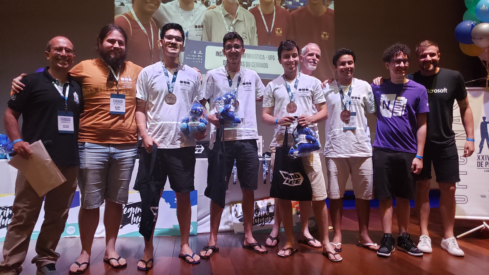
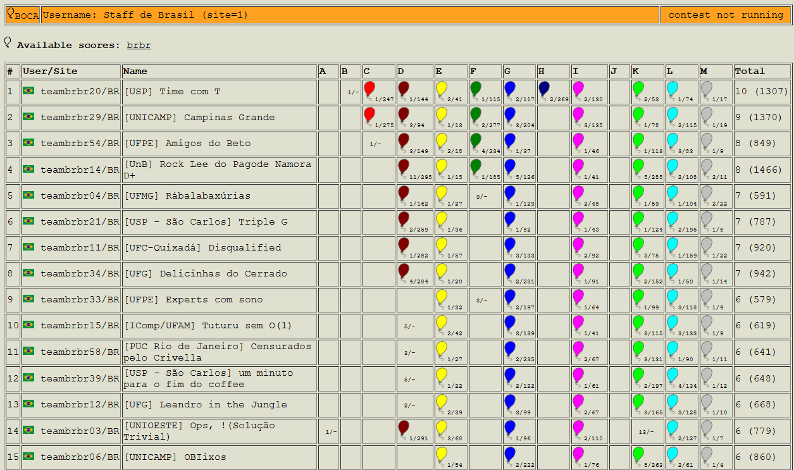
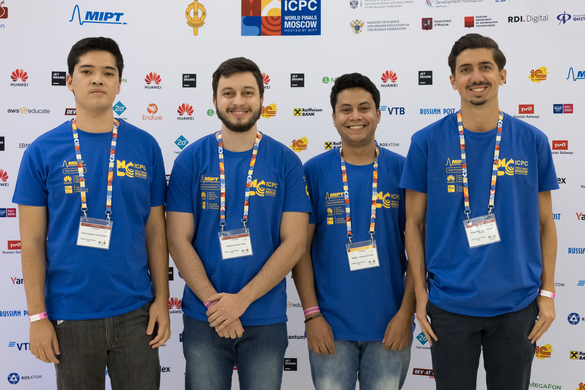

# 2019

---

## XXIV Maratona de Programação - 2019

Em 2019 ocorreu a XXIV Maratona SBC de Programação. A primeira fase ocorreu em 14 de setembro em 47 sedes, com a participação de 726 times de 224 escolas.

---

## Resultados da competição

A competição ocorre simultaneamente nas 6 regiões latino-americanas. A prova é a mesma, e a equipe de juízes corrige as submissões de forma centralizada.

Neste ano, a equipe <a href="https://maratona.sbc.org.br/hist/2019/resultados19/fotos/ufg.jpg" target="_blank">UFG - Delicinhas do Cerrado</a> (Paulo Kataki, Rafael Silva, Misael Moraes e o coach Humberto Longo) conquistou a medalha de bronze na <a href="https://maratona.sbc.org.br/hist/2019/resultados19/reports/scoreBrasil.html" target="_blank">oitava colocação</a>, garantindo a classificação para a Final Mundial em Moscou, na Rússia.

---

## Final Mundial

