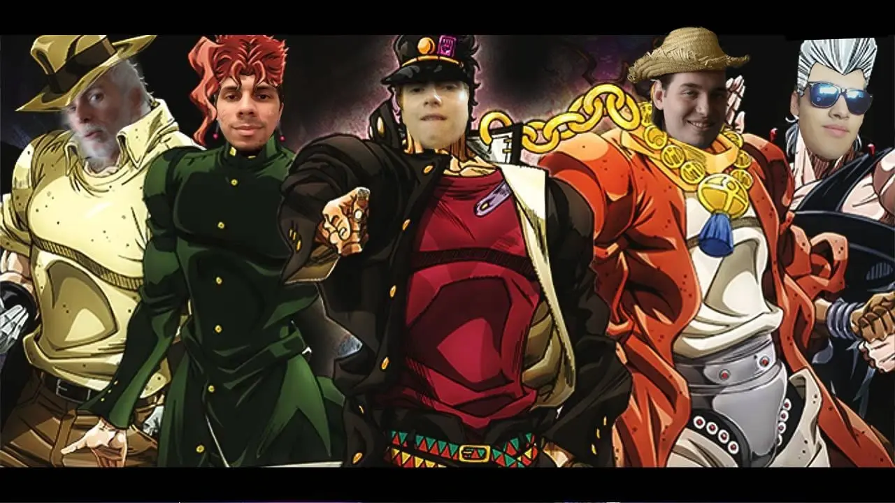
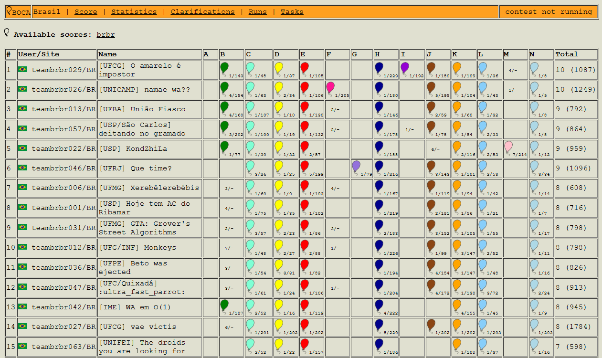

# 2020

---

## XXV Maratona de Programação - 2020

Em 2020 ocorreu a XXV Maratona SBC de Programação. A primeira fase ocorreu em 14 de novembro de 2020 em 27 sedes estaduais online, com a participação de 799 times de 196 escolas. Houve times participantes de todos os estados do Brasil.

---

## Resultados da competição

A competição ocorre simultaneamente nas 6 regiões latino-americanas. A prova é a mesma, e a equipe de juízes corrige as submissões de forma centralizada.

Neste ano, a equipe <a href="https://maratona.sbc.org.br/hist/2020/final20/fotos/times/ufg.webp" target="_blank">UFG - Monkeys</a> (Leandro Alves Vianna, Rafael de Castro Silva, Gustavo Leal e coach Paulo Kataki e co-coach Humberto Longo) conquistou a medalha de bronze na <a href="https://maratona.sbc.org.br/hist/2020/final20/resultados/reportsbr/BrasilScore.html" target="_blank">décima colocação</a>.

