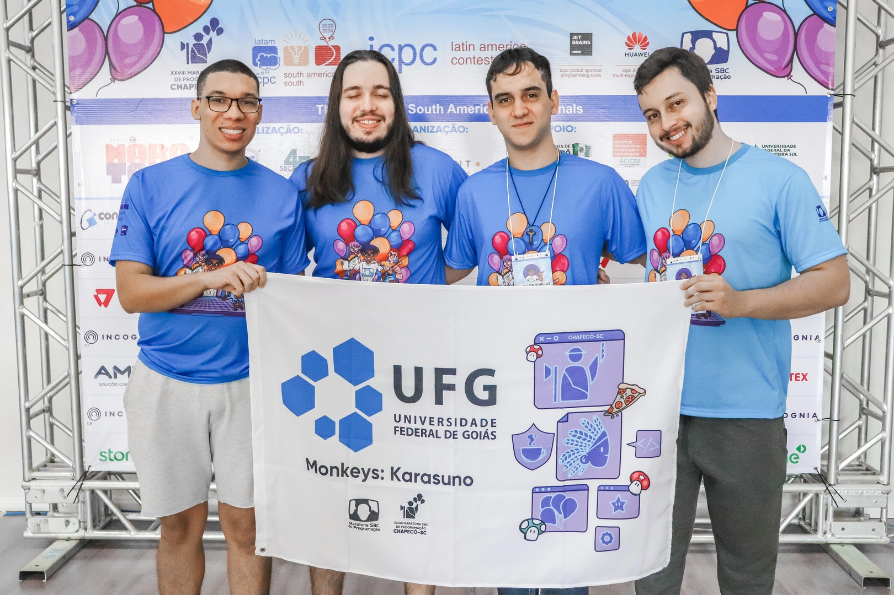
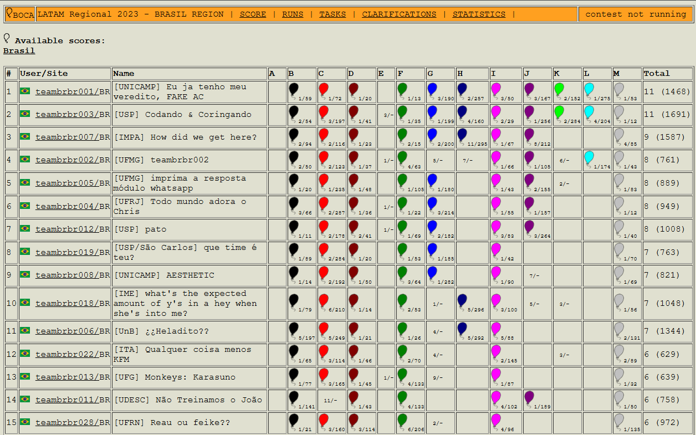
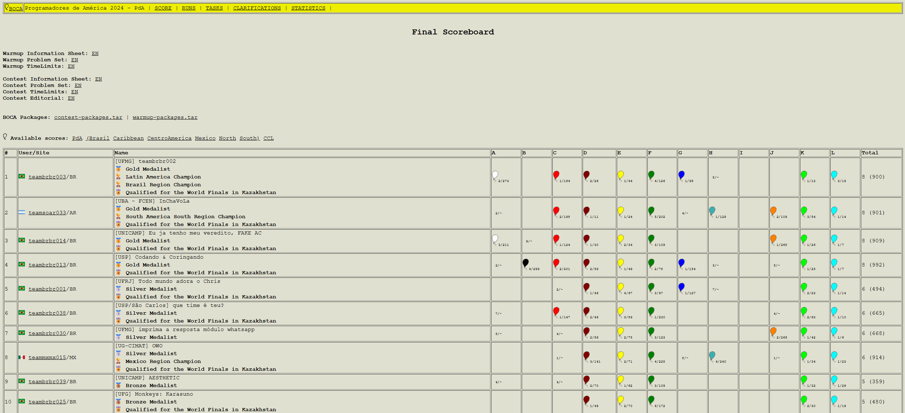
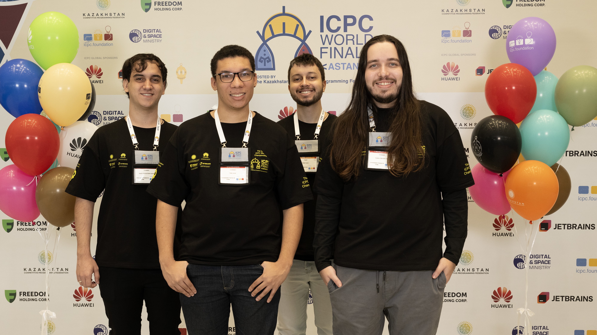
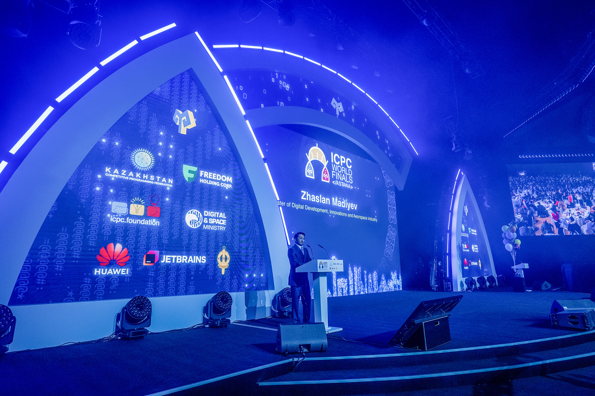

# 2023

---

## XXVIII Maratona de Programação - 2023

Em 2023 ocorreu a XXVIII Maratona SBC de Programação. A primeira fase ocorreu em 2 de setembro em 44 sedes espalhadas pelo país: 4 no Centro-Oeste, 14 no Nordeste, 5 no Norte, 14 no Sudeste e 7 no Sul. Tivemos a participação de 726 times de 181 instituições de todo o país.

---

## Resultados da competição

A competição ocorre simultaneamente nas 6 regiões latino-americanas. A prova é a mesma, e a equipe de juízes corrige as submissões de forma centralizada.

Neste ano, a equipe <a href="https://maratona.sbc.org.br/hist/2023/photos/teambrbr013.webp" target="_blank">UFG - Monkeys: Karasuno</a> (Dayllon Vinícius Xavier Lemos, Nelsi Junior, Gustavo Leal e coach Rafael de Castro Silva) terminou a prova na <a href="https://maratona.sbc.org.br/hist/2023/contest/Score.html" target="_blank">décima terceira colocação</a>, garantindo a classificação para a Final Latino-Americana em Guadalajara, no México.

---

## Final Latino Americana

Na final latino americana, a equipe <a href="https://news.icpc.global/galleryLAC/?album=2024&event=Photo+Tour&photo=54485133374" target="_blank">UFG - Monkeys: Karasuno</a> (Dayllon Vinícius Xavier Lemos, Nelsi Junior, Gustavo Leal e coach Rafael de Castro Silva) conquistou a medalha de bronze na<a href="https://scorelatam.naquadah.com.br/pda24/#" target="_blank"> décima colocação</a>, garantindo a classificação para a Final Mundial em Astana, no Cazaquistão.

---

## Final Mundial

