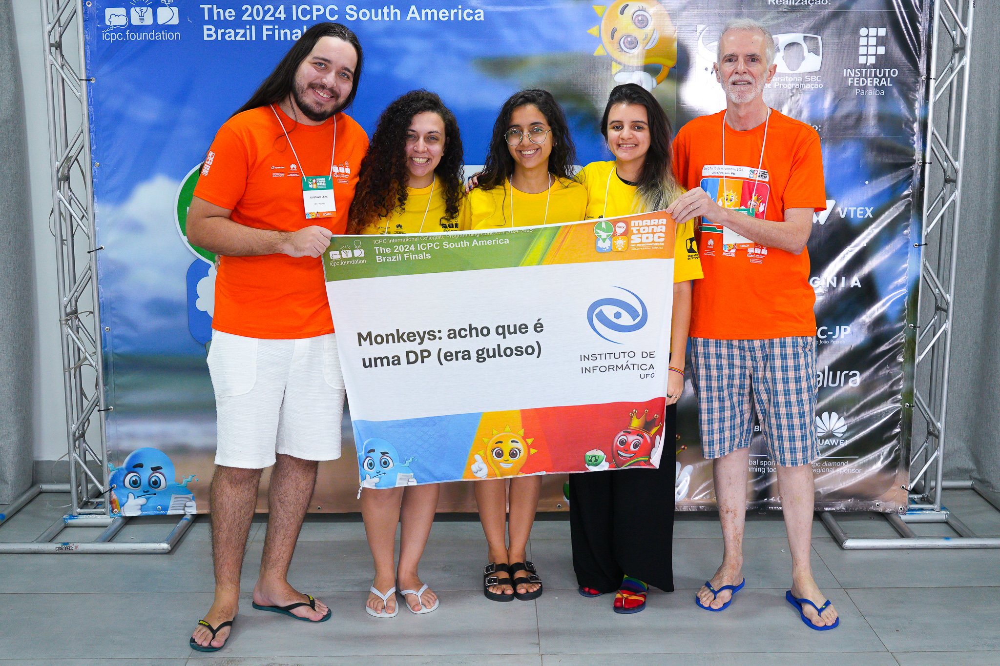
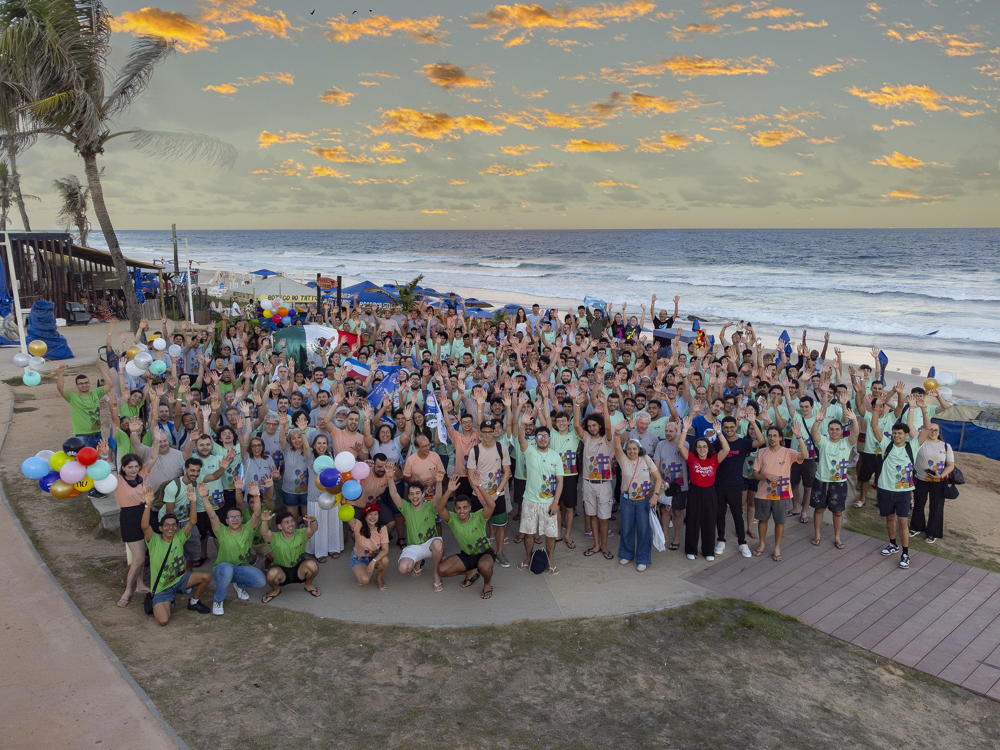

# 2024

---

## XXIX Maratona de Programação - 2024

A primeira fase da Maratona SBC de Programação ocorreu em 31 de agosto de 2024 em 48 sedes espalhadas pelo país: 6 no Centro-Oeste, 15 no nordeste, 7 no norte, 16 no sudeste e 4 no sul, reunindo 880 times de 226 escolas.

---

## Resultados da competição

A competição ocorre simultaneamente nas 6 regiões latino-americanas. A prova é a mesma, e a equipe de juízes corrige as submissões de forma centralizada.

Neste ano, a equipe <a href="https://maratona.sbc.org.br/hist/2024/JoaoPessoa/fotos/ufg-meninas.jpg" target="_blank">UFG - Monkeys: acho que é uma DP (era guloso)</a> (Nicole Liecheski, Lauane Mateus Oliveira de Moraes, Mariana Santos, e coaches Humberto Longo e Gustavo Leal) conquistou o prêmio de <a href="https://maratona.sbc.org.br/hist/2024/JoaoPessoa/brbr/Score.html#" target="_blank">melhor time feminino da final brasileira</a>, garantindo a classificação para a Final Latino-Americana em Salvador, no Brasil.

---

## Final Latino Americana

