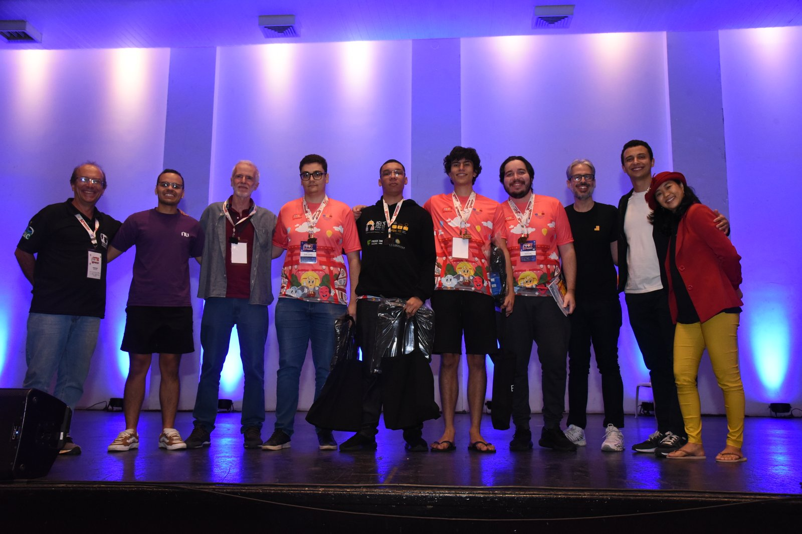
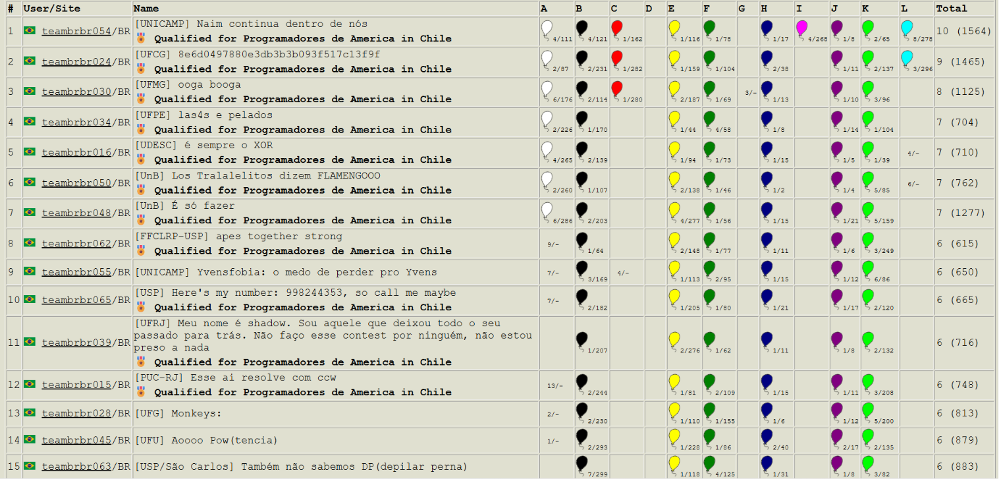

# 2025

---

## XXX Maratona de Programação - 2025

A primeira fase da Maratona SBC de Programação ocorreu em 13 de setembro de 2025 em 53 sedes espalhadas pelo país: 5 no Centro-Oeste, 17 no nordeste, 7 no norte, 18 no sudeste e 6 no sul, reunindo 1025 times de 239 escolas.

---

## Resultados da competição

A competição ocorre simultaneamente nas 6 regiões latino-americanas. A prova é a mesma, e a equipe de juízes corrige as submissões de forma centralizada.

Neste ano, a equipe <a href="https://maratona.sbc.org.br/hist/2025/latam-2025/fotos/ufg.webp" target="_blank">UFG - Monkeys: </a> (Nelsi Junior, Felipe do Espírito Santo Sabino, Danilo Dias, coaches Gustavo Leal e Humberto Longo.) terminou a prova na décima terceira colocação, garantindo a medalha de bronze na competição.

