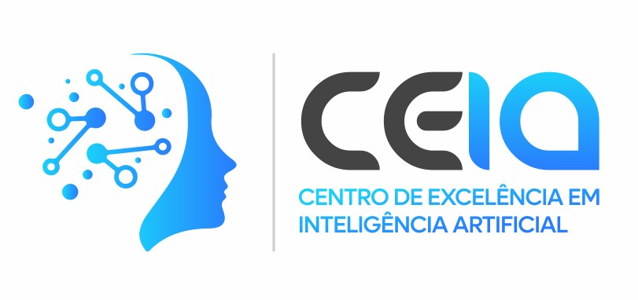

---
hide:
  - navigation
---

# NeoSpace

A NeoSpace, membro do <a href = "https://www.nvidia.com/pt-br/case-studies/neospace/" target = "_blank"> NVIDIA Inception</a>, ajuda empresas a transformar trilhões de registros tabulares, de eventos e não estruturados em previsões e decisões em tempo real usando grandes modelos fundamentais tabulares empresariais. Sua plataforma NeoData, com tecnologia de computação acelerada da NVIDIA, oferece o desempenho e a escalabilidade operacional necessários para o processamento de dados empresariais complexos. Bancos, operadoras de telecomunicações, seguradoras e empresas em diversos setores já estão adotando essa nova tecnologia para desbloquear maior inteligência e valor de seus dados. Um dos maiores bancos privados da América Latina usou os modelos fundamentais da NeoSpace para melhorar significativamente a decisão de crédito e ampliar a oferta de crédito parcelado.

Para mais informações: <a href = "https://www.neospace.ai/" target = "_blank">NeoSpace</a>

---

# CEIA - Centro de Excelência em Inteligência Artificial

O Centro de Excelência em Inteligência Artificial (CEIA) da Universidade Federal de Goiás
(UFG) é um polo de inovação que desenvolve soluções de alto impacto através do uso de
dados e da Inteligência Artificial. Desde sua fundação em 2019, o CEIA tem se destacado
como uma iniciativa pioneira, resultado de uma política pública da Fundação de Amparo
à Pesquisa do Estado de Goiás (FAPEG), operando sob o modelo de tríplice hélice que
envolve a colaboração entre academia, governo e empresas.

Para mais informações: <a href = "https://ceia.ufg.br/" target = "_blank">CEIA - UFG</a>